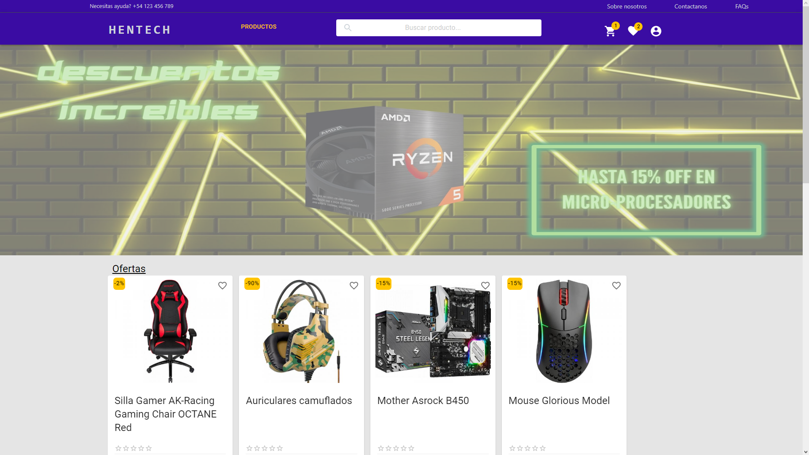
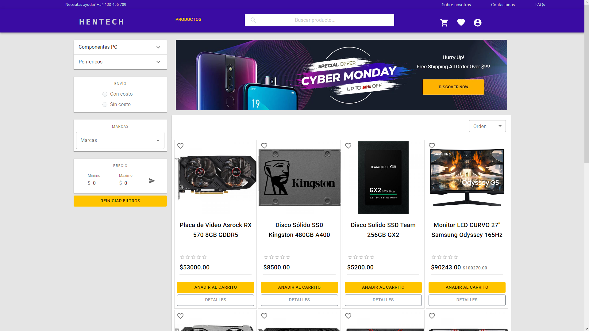
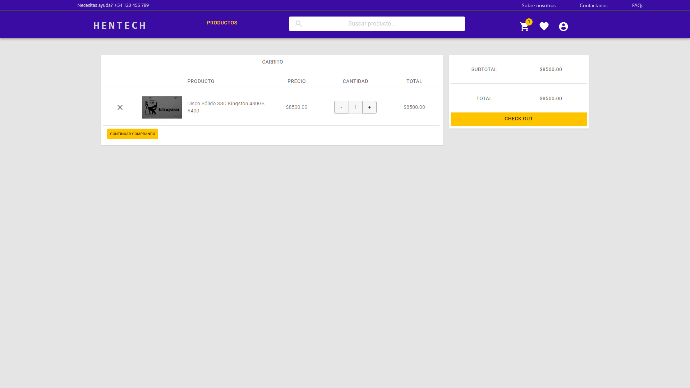
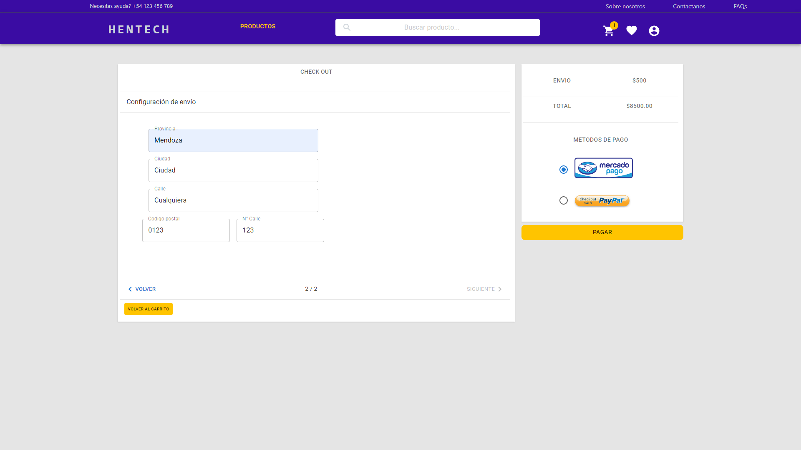
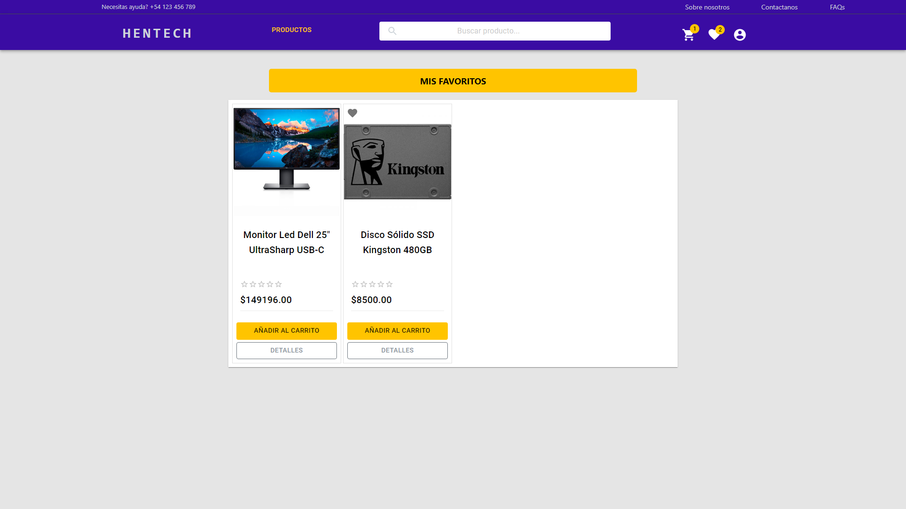
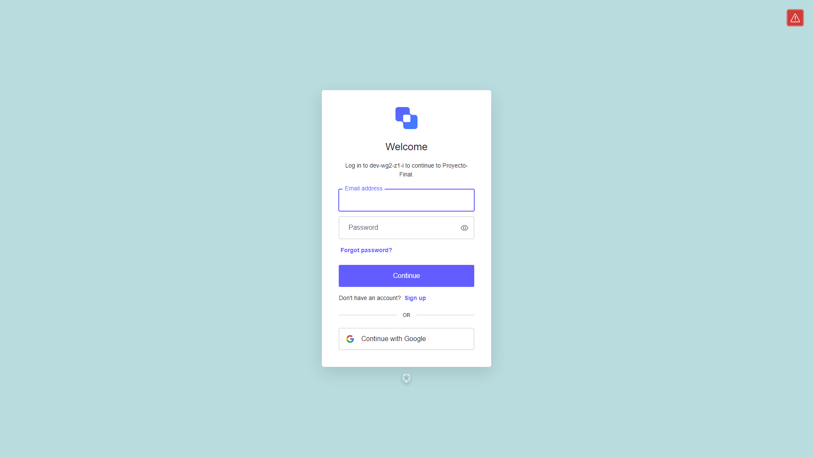
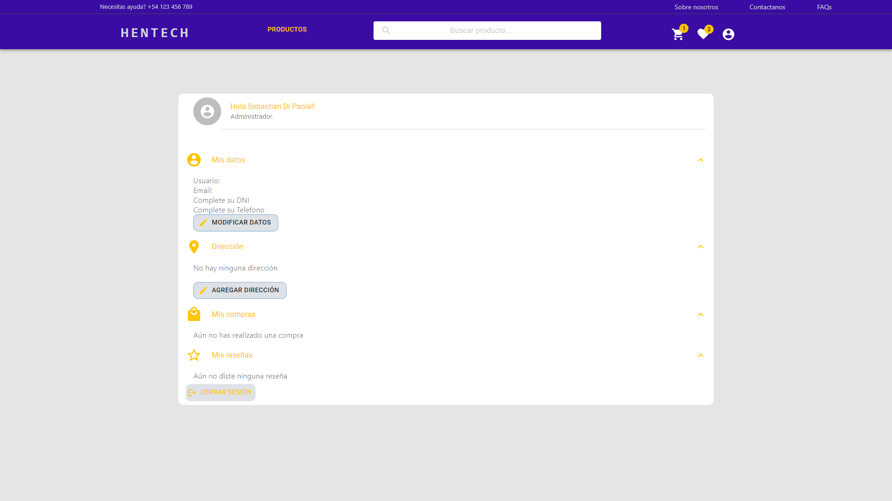
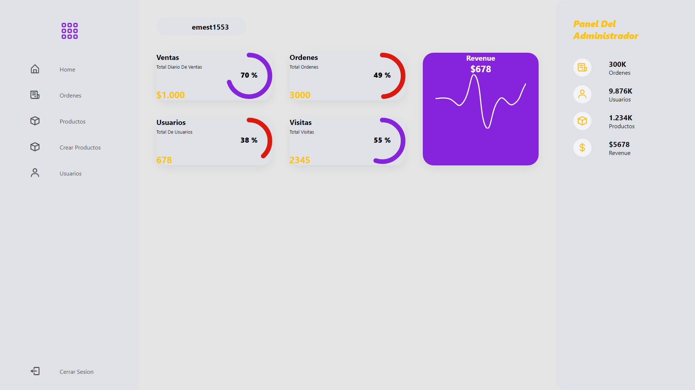

# E-commerce - HENTECH

Link del Sitio Web: <a href= "https://deployment-ruddy.vercel.app">Sitio Web</a>

## User Stories

- Create account: As a user you want to create an account to be able to make purchases
- Login: As a user you want to be able to access the page through the personal account
- Search engine: As a user you want to be able to search for a particular product
- Add to favorites: as a user you want to be able to save my favorite products
- Opinions-Rating: As a user after purchasing a product I want to rate/comment my agreement or disagreement
- User profile: As a user you want to have a panel where you can see my data
- Filters: As a user you want to be able to filter the products based on different filters
- Ordering: As a user you want to be able to order the products based on different criteria
- Payment management: As a user you want to know what means of payment can be used
- Chat: As a user you want to have the ability to communicate with the seller
- Purchase history: As a user you want to be able to view the purchases made previously
- Search history: As a user, you want to be able to view the searches carried out previously.

## Landing:

The first page that shows us the products that are on sale, the best sellers and those that might interest you. We also have a button to redirect us to home, a search bar, a button to see the products in the shopping cart and a button to redirect us to the user profile. We also have an "About us", "Contact us" and "FAQs" button.

## Home:

The main page shows us all the products on the web, along with different filters and orders to find the product we want. The product cards have buttons to add to favorites, add to shopping cart and view details.

## Shopping Cart:

This page shows us the products that we want to buy along with buttons to remove the product from the cart, increase or decrease the quantity and the subtotal and total cost of the purchase. It also has a button to continue with the purchase.

## Checkout: 

On this page we can enter our personal data and address to complete the purchase and home delivery of the product. The shipping price and total to pay are detailed. We have PayPal and Mercado Pago as a payment method.

## Favorite: 

On this page we can see our favorite products along with buttons to add to cart, view details or remove from favorites.

## Login:

Here we can register as users using our Gmail email or a different email and password. There is also the option to recover password.

## User Profile:

On this page we can see our personal data, our address, purchases made and reviews given. You can also see a button to log out.

## Admin Dashboard: 

This page is exclusively for the admin, who can see all the products on the web, create new products, see all registered users, disable their accounts or turn them into admin. You can also see the status of the orders generated by the purchase of products.

## CREDITS: 

* React

* React-Redux

* Redux

* Material UI

* PostgreSQL

* Sequelize

* NodeJS

* Express

* Cloudinary 

* Auth0